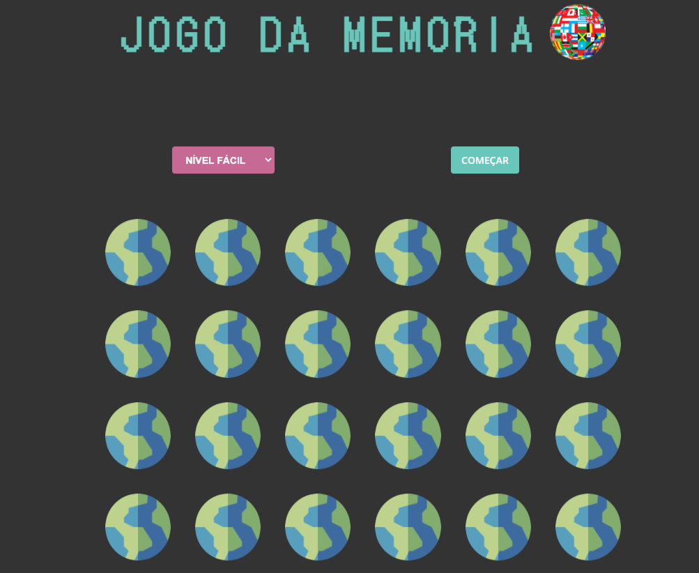
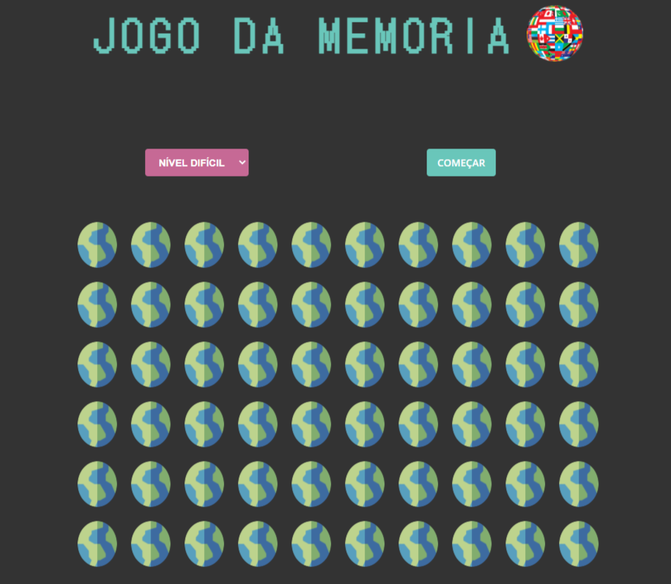
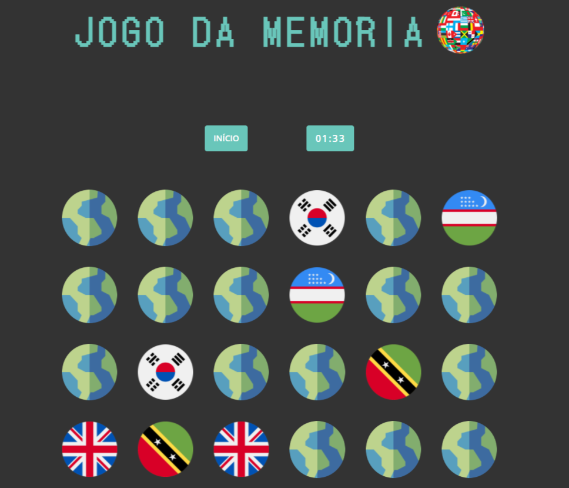
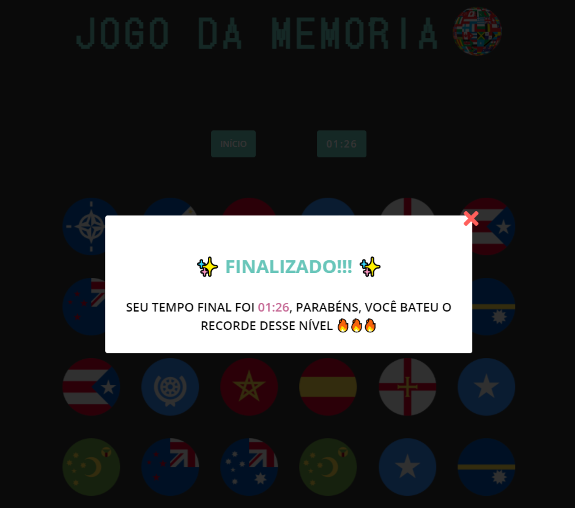

# Memory-game

Jogo da Memória com tema de países do mundo, feito com SASS e JS puro.

- [x] 3 níveis diferentes (fácil = 12 pares, médio = 24 pares e difícil = 30 pares)
- [x] A partir do nível escolhido, gerar os países randomicamente no HTML, dentre mais de 250 opcões que estão no arquivo img
- [x] Ao finalizar cada game, salvar tempo no Local Storage, e verificar se é um novo recorde de acordo com o nível
- [x] Em seguida, exibir modal com uma mensagem congratulando o usuário de acordo com o resultado

