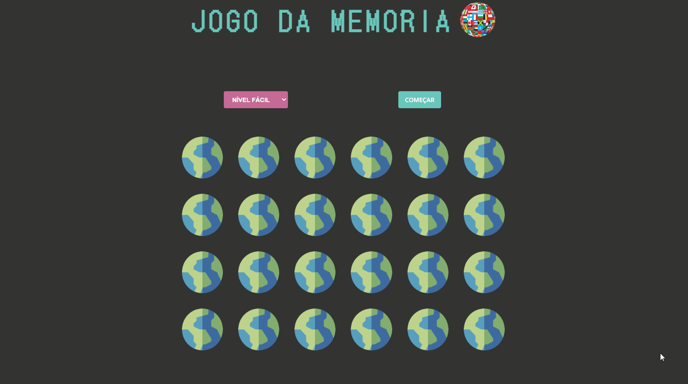
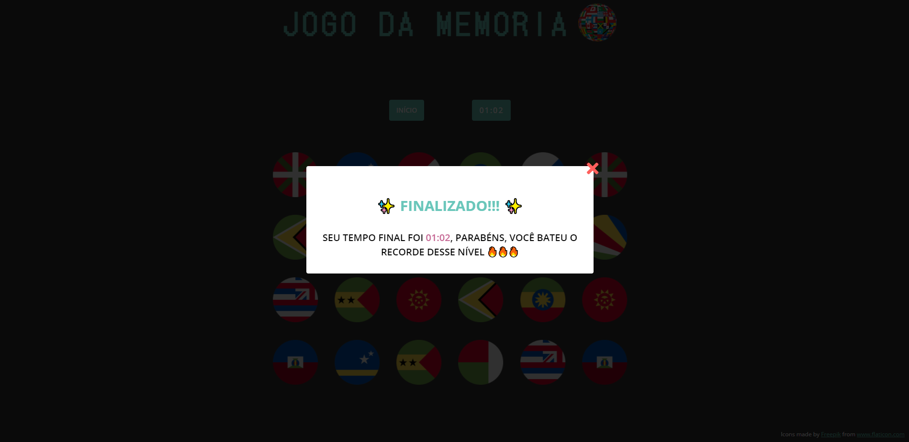

# Memory-game

Jogo da Memória com tema de países do mundo, feito com SASS e JS puro, o jogo possui 3 níveis de dificuldade sendo, fácil com 12 pares, médio com 24 pares e difícil com 30 pares, a partir do nível escolhido, os países são gerados randomicamente na página, dentre mais de 250 opções. Ao finalizar cada partida, o resultado fica salvo no local storage, e é comparado com resultados anteriores, logo em seguida é exibido um modal congratulando o usuário de acordo com o resultado. Acesse o projeto [aqui](https://memory-game-swart.vercel.app/).

